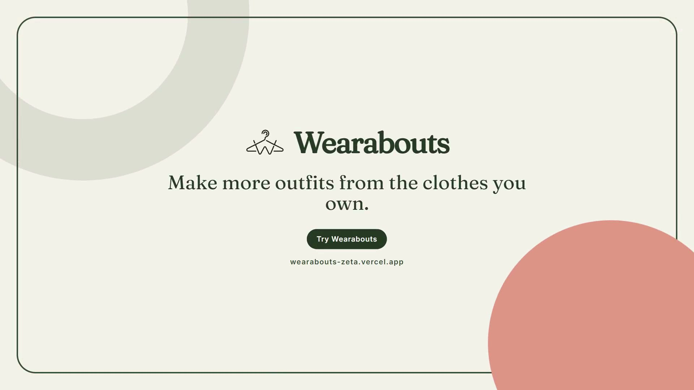

# Wearabouts

Wearabouts is a wardrobe-first clothing assistant for Singapore. You photograph the clothes you already own, get outfits built from them for an occasion and the day's NEA forecast, and check whether a new item duplicates something in your wardrobe before you buy it.

CS3216 Assignment 3, Group 2.

- Live application: https://wearabouts-zeta.vercel.app
- Repository: https://github.com/joojaja/CS3216-A3-Group2

## Application preview

<a href="app/public/launch-video/video.mp4">
  
</a>

https://github.com/user-attachments/assets/75a62ef2-0f81-4bb8-92a6-a14e29cf6908


| Add an item | Browse your wardrobe |
| --- | --- |
|  |  |

| Plan an outfit | Check a potential purchase |
| --- | --- |
|  |  |

## Team

| Name | Matriculation number | Contribution |
| --- | --- | --- |
| Maahir Garg (@maahir-garg) | A0284729M | Landing page and onboarding integration, analytics, Open Graph card and sitemap, security hardening, submission documentation |
| Brian (@joojaja) | A0308053M | Outfit planner, purchase evaluation, Explore feed, free and premium tiers, repository and deployment owner |
| Chi An (@tsaichian) | [TO FILL: matriculation number] | Sizing, daily outfit feed, saved outfits and My Style |
| Sanjeev Ravichandran (@sanjeevr123) | A0273811H | Landing page hero, header, feature tour, pricing and story motion |

## What it does

- **Wardrobe.** Upload a photo. The browser removes the background, Gemini suggests category, colour, pattern, formality and weather tags, and you confirm or correct each one before saving.
- **Outfit planner.** Describe an occasion in plain English. The app plans two or three outfits from your confirmed items only, explains each one and uses the live Singapore forecast. Your feedback (too warm, too formal, disliked colours) shapes later plans.
- **Daily outfits.** Rules build valid outfits for today's weather, and the model ranks and explains three of them.
- **Purchase check.** Upload a screenshot of something you might buy. The app lists similar items you own and gives a verdict (likely redundant, potentially useful, fills a wardrobe gap, or not enough information) backed by that evidence.
- **Sizing.** Save your measurements once, then match them against stored brand charts or a size chart screenshot. The result names its source chart.
- **My Style and Explore.** A colour palette and style groups from your wardrobe, and a small curated catalogue ranked against it.

## Tech stack

Next.js 16 (App Router) with React 19 and TypeScript, Tailwind CSS v4, Supabase (Postgres, Auth, private Storage, row-level security), Google Gemini through the Vercel AI SDK with Zod-validated structured outputs, NEA forecasts from data.gov.sg, and Vercel for hosting, Web Analytics and Speed Insights. [`docs/architecture.md`](docs/architecture.md) maps each feature to its routes, model and rules.

## Local setup

### Requirements

- Node.js 22.18 or newer
- npm
- A Supabase project for persistent accounts, wardrobe data and private image storage
- Google AI Studio keys for the Gemini-backed features you want to use

### Install and start the app

```bash
git clone https://github.com/joojaja/CS3216-A3-Group2.git
cd CS3216-A3-Group2
cd app
npm ci
cp .env.example .env.local
npm run dev
```

Open http://localhost:3000 after the development server starts.

### Configure Supabase

1. Create a Supabase project.
2. Open its SQL editor and run [`app/supabase/schema.sql`](app/supabase/schema.sql). The script adds missing application objects and does not delete existing rows.
3. Copy the project URL and publishable key into `.env.local` as `NEXT_PUBLIC_SUPABASE_URL` and `NEXT_PUBLIC_SUPABASE_PUBLISHABLE_KEY`.
4. Add `http://localhost:3000/auth/callback` to the allowed redirect URLs under Supabase Authentication.

### Configure Gemini

Add only the keys needed for the workflows you want to test. [`.env.example`](app/.env.example) documents every variable.

- `GOOGLE_GENERATIVE_AI_API_KEY` powers photo analysis, purchase checks, image edits and the sizing screenshot reader. Calls made through a project with billing enabled may incur charges.
- `GOOGLE_GENERATIVE_AI_FREE_API_KEY` powers the outfit planner, daily outfits and My Style.
- `GOOGLE_GENERATIVE_AI_RAG_API_KEY` powers Explore.

The two free-tier workflows never fall back to the billed key.

### Optional sample wardrobe

Run `npm run seed:wardrobe` from `app/` to add 23 confirmed sample items without making an AI call. Run `npm run seed:wardrobe -- --remove` to remove them.

Without Supabase variables, development mode offers a labelled preview login (`test@gmail.com` / `testtest`) that saves nothing. Production setup is in [`docs/deployment.md`](docs/deployment.md).

## Checks and CI

From `app/`, run `npm run lint`, `npx tsc --noEmit`, `npm test` and `npm run build`. GitHub Actions runs all four on every pull request and push to `main`, alongside a Markdown link check, a dependency audit and CodeQL security scanning. Dependabot opens weekly update pull requests for npm packages and Actions.

The 216 tests cover deterministic and security-sensitive code: size matching, outfit rules, colour families, AI error mapping, prompt cleaning, the purchase verdict rule, style-group repair and analytics URL redaction. `app/scripts/eval-sizing.mjs` evaluates the sizing model against screenshot fixtures and only runs when a person sets `SIZING_EVAL_I_AM_HUMAN=1`, because it spends the billed key.

## Documentation

- [`docs/architecture.md`](docs/architecture.md): how each feature is built and where the model sits in it.
- [`docs/analytics.md`](docs/analytics.md): analytics tools, event dictionary and funnels.
- [`docs/deployment.md`](docs/deployment.md): environment variables, Supabase, Vercel and analytics setup.
- [`docs/design.md`](docs/design.md): brand mark, design tokens and onboarding flow.
- [`docs/launch-campaign.md`](docs/launch-campaign.md): Product Hunt listing and launch plan.
- [`docs/size-chart-sources.md`](docs/size-chart-sources.md): sources for the stored brand size charts.
- [`app/README.md`](app/README.md): route table for the web app.

## Resources and credits

- [Next.js](https://nextjs.org/docs), [Supabase](https://supabase.com/docs), [Vercel AI SDK](https://ai-sdk.dev/docs) and [Gemini API](https://ai.google.dev/gemini-api/docs) documentation.
- [data.gov.sg](https://data.gov.sg/) NEA 2-hour, 24-hour and 4-day forecast APIs.
- [IMG.LY background removal](https://github.com/imgly/background-removal-js) (AGPL-3.0), bundled under `app/public/vendor/background-removal/` with its licence.
- The W-and-hanger mark and landing imagery were designed by the Wearabouts team. See [`docs/design.md`](docs/design.md).
- [Fraunces](https://fonts.google.com/specimen/Fraunces) and [Inter](https://fonts.google.com/specimen/Inter) (SIL Open Font License), self-hosted.

## Licence

MIT. See [`LICENSE`](LICENSE).
